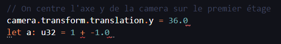
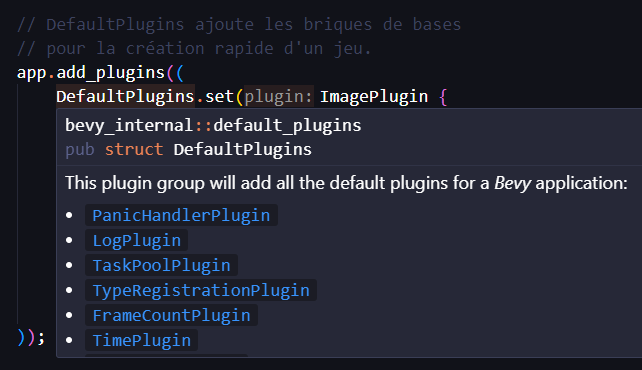

# Installation

**Prérequis**
* avoir **Rust** installé sur votre appareil (`rustc -V` dans la console pour vérifier)
* avoir **Git** (`git -v` pour vérifier)

*Conseils:*
* utiliser **Visual Studio Code** pour voir vos erreurs, les descriptions des fonctions... en directe.

## Installation local du projet

*Copie des fichiers du projet dans l'emplacement ./isent_it*
`git clone https://github.com/IsenEngineering/Isen-t-it.git ./isent_it`

*(ps: si vous êtes dans ~/Documents, le projet sera dans ~/Documents/isent_it)*

**Si vous avez VS Code**
*Ouverture dans Visual Studio Code*
`code ./isent_it`

*fermeture du terminal / de la console*
`exit 0` ou simplement `exit`

## Commandes du projet

*Vérifie les erreurs dans le projet*
`cargo check`

*Montre les corrections d'erreurs et les suggestions disponibles dans le projet*
`cargo clippy`

*Lancement du projet en mode débug (développement)*
`cargo run` 

*Construction du binaire*
`cargo build --release`

*Construction du binaire pour la version web*
(il faudra faire `cargo install -f wasm-bindgen-cli`)
`cargo build --release --target wasm32-unknown-unknown`
et `wasm-bindgen --out-dir ./web/js --target web ./target/wasm32-unknown-unknown/release/client.wasm`

*Ajout d'une librairie externe / dépendance*
`cargo add [votre librairie]`

*Suppresion des binaires (les fichiers qui peuvent prendre beaucoup de stockage)*
`cargo clean` *(cela supprime le dossier target du projet)*

## Proposition de modifications

Désormais, vous pouvez modifier le code à votre guise locallement.
Mais, l'objectif étant de faire avancer le projet à plusieurs parallèlement, il faut bien un moyen de modifier le code du projet sur Github.

[Voici le guide qui vous permet de coopérer](./organisation.md)